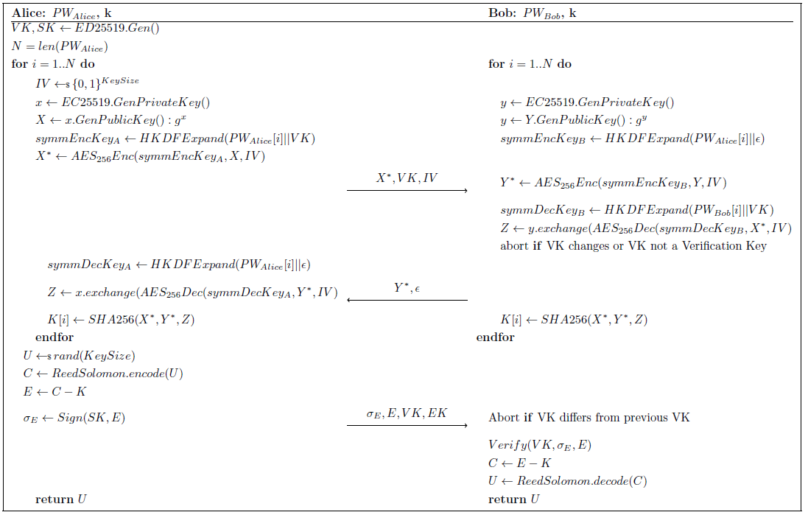
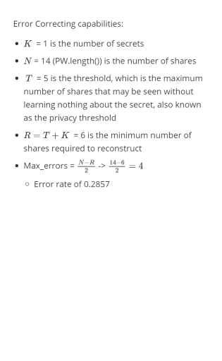

# Requirements
- Python 3.7.3
- Cryptographic Library for symmetric and asymmetric cryptography [https://cryptography.io/en/latest/](https://cryptography.io/en/latest/)
# Protocol 

# fPake
 [fPAKE.pdf](fPAKE.pdf) 



## Initialization
- fpake(weakPW,securityParam,Connection)
  - weakPW: is the binary representation of the password as a String
  - securityParam: is one of the bleow discribed security parameters 0 mean 128 Bit 1 means 244 Bit
  - Connection: needs to implement the ConnectionInterface to implement both methods
    - send(): which should send the given data to the other party
    - receive(): blocking function which receives the send data
    - A default TCP/IP connection is implemented and can be used

## initiator
- fpake.init_Protocol()
 - Optional benchmark parameter expects an Dict, if none benchmarking is not executed 

## receive_protocol
- fpake.receive_protocol()
 - Optional benchmark parameter expects an Dict, if none benchmarking is not executed

## Benchmarking
- use the config.ini to configure the devices, one sender and one receiver
- simply run the benchmarks via 'python3 benchmark.py'

# Robust Secret Sharing
- RSS.RSSCodes.robustShamir(N, T, K = 1,size=32,Prime=None)
  - N Number of shares to be created
  - T Privacy Threshold = Max number of shares that may be seen without learning anything about the secret
  - K Number of secrets
  - size Security size / key Size / Size for the Prime Number
  - Prime Takes the given prime to create the prime field. Prime = None -> Prime = Crypto.Util.number.getPrime((size*8), os.urandom)

- Example :[Example.pdf](shamir.pdf) 



# Crypto Profiles

## 128 Bit

- SHAKE128
- AES256 with CBC (BSI TR-02102-1)
  - this was nessesary since the KDF did not support keys lower than 256 Bit
- brainpoolP256r1 (Technische Richtlinie TR-02102-3 vom BSI) Kleiner als 256 nicht zulässig 
  - Oder:  Curve 25519 (https://tools.ietf.org/html/rfc8031#section-4 (Noch kein BSI standard))
- HKDF mit SHA128 (Appendix B B.1. Key derivation BSI TR-02102-1)

## 244 Bit

- SHA3 256
- AES256 with CBC
- Curve448 https://tools.ietf.org/html/rfc8031#section-4 for digitale signatur and Key Exchange 
- HKDF mit SHA3 256  (Appendix B B.1. Key derivation BSI TR-02102-1)

# Getting Started

## Use in python3

For all examples we use the following passwords:
- 101101010110**00**
- 101101010110**11**

the last two bist differ from each other

### On two different machines
#### Receiving machine
```python
from fPAKE import *

sec_param = 1
PW = "10110101011000"
IP = "192.169.0.101"

fpake=  fPAKE(PW,securityParam=sec_param,connection=IPConnection(IP=IP))
fpake.receive_protocol()
```
#### Initiating machine
```python
from fPAKE import *

sec_param = 1
PW = "10110101011011"

fpake=  fPAKE(PW,securityParam=sec_param,connection=IPConnection())
fpake.init_Protocol()

```
### On a single machine
```python3
def sender(connection=IPConnection()):  
    print(fPAKE(connection=connection, securityParam=1, weakPW="10110101011011").init_Protocol())


def receiver(connection=IPConnection()):
    print(fPAKE(connection=connection, securityParam=1, weakPW="10110101011000").receive_protocol())

t2 = Thread(target=receiver)
t1 = Thread(target=sender)
t2.start()
t1.start()

t1.join()
t2.join()
```
## Use from commandline
The ip can also be `localhost`
```shell
python fpake.py -ip 192.168.0.101 -pw 10110101011000 -role receiver -sec_param 1
```
```shell
python fpake.py -ip 192.168.0.101 -pw 10110101011011 -role initiator -sec_param 1
```

